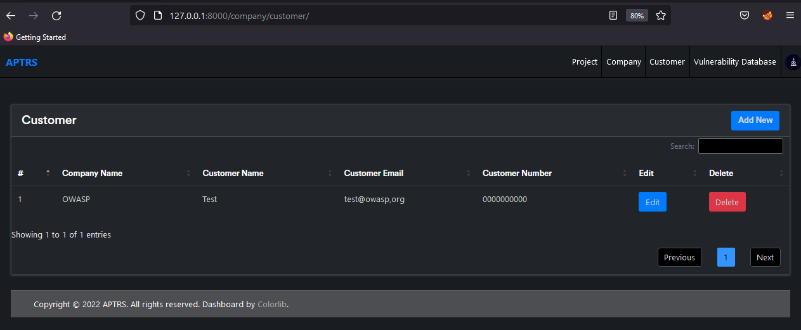
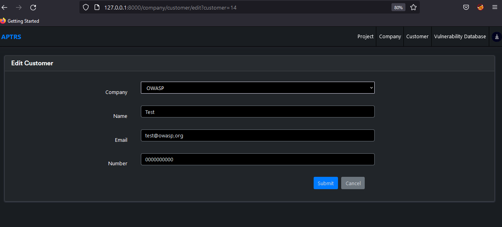

# Customer

The Customer option allows you to create a new customer for the company. For each project and company, there will be a team involved from the penetration tester and Customer company. You can create a customer for the company. The details will be used while creating the report for the project.

## Customer List

If you acess the `http://127.0.0.1:8000/company/customer/` you are see all the customer and company for the customer in the table. You can either delete, edit or add new new from the same page.

## Edit/Add Customer 

Once you click on the edit/add button in the above table. You can edit/add the customer details like Company Name, Customer Name, Customer Emaill and Customer Mobile Number.

