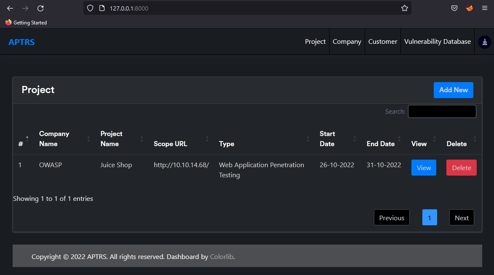
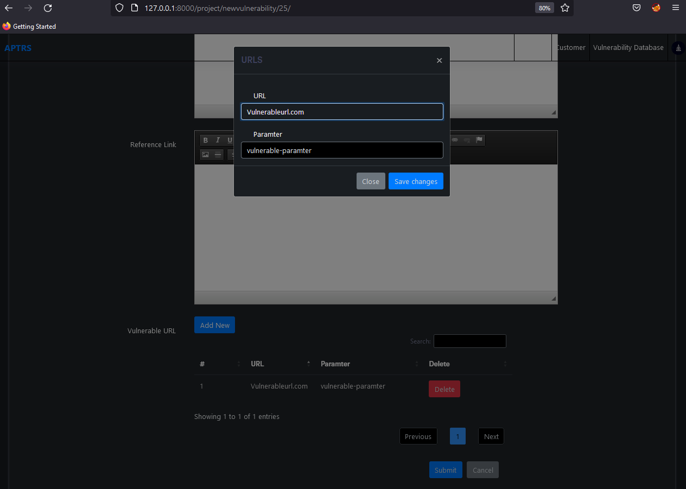

# Project

The Project is one of the main functions of the tool. It is where you will create a project for any Company/Customer. Each project will be connected with a customer company and each project will contain its vulnerability and reports.

## Project List

If you acess the `http://127.0.0.1:8000/` you are see all the Project in the table. YOu can view all the details for that project like, company name, Scope URL, Project start and end date etc. You can either delete, edit or add new new from the same page. 

!>Once you delete any project all the vulnerabilites/reports for that project will be deleted.

## Add Project 

Once you click on the add button in the above table. You can add details like company, scope url, project name, project start date end date etc.

!>Once you create a project you will not able to edit the company for the project.

## View Project 

Once you click on view project in the table. You can edit the project, view/edit/add vulnerabilities for the project and also you can generate the report

### Edit Project

You can click on project tab and can edit the project details. 

### Vulnerability 

Once you click on the vulnerability tab, you can see all the vulnerabilities for the project. You can either delete/edit or add new vulnerabilities from here.

### Edit/Add Vulnerability

When you click on the edit/add button you will be able to add details like `vulnerability title, POC, description, Recommendation, Refference link, Instances, CVSS Score` etc.

!> The vulnerability title field is an input box with drop down and search. It will list the vulnerabilities from the vulnerability database. Once you select any it will automatically replace the data like Title, description, Recommendation, Refference link etc.

!> If you want to add a totally new vulnerability and its not showing in drop down menu. You can still enter any title and it will be accepted by the app.

### Report

Last you have option to download the PDF report. You can view the demo report from [here](https://github.com/Anof-cyber/APTRS/blob/main/Doc/Report/Web%20Application%20Penetration%20Testing%20Report%20of%20Juice%20Shop.pdf)
