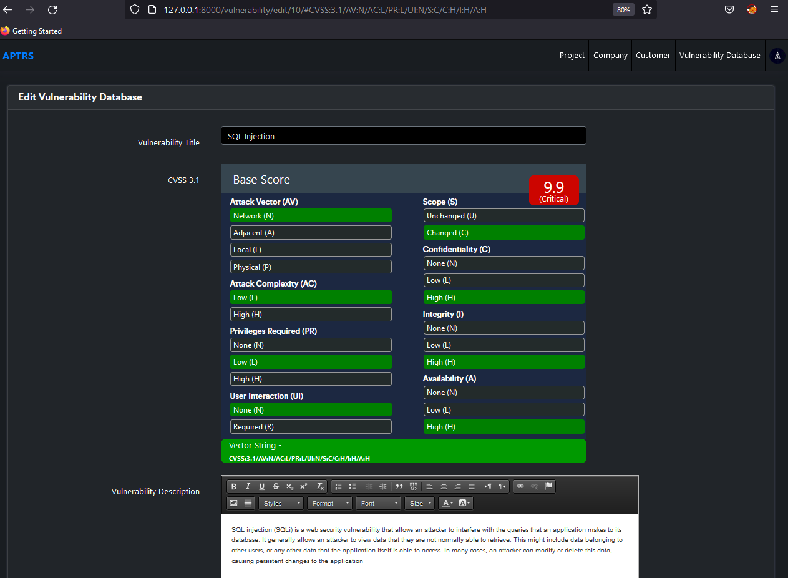
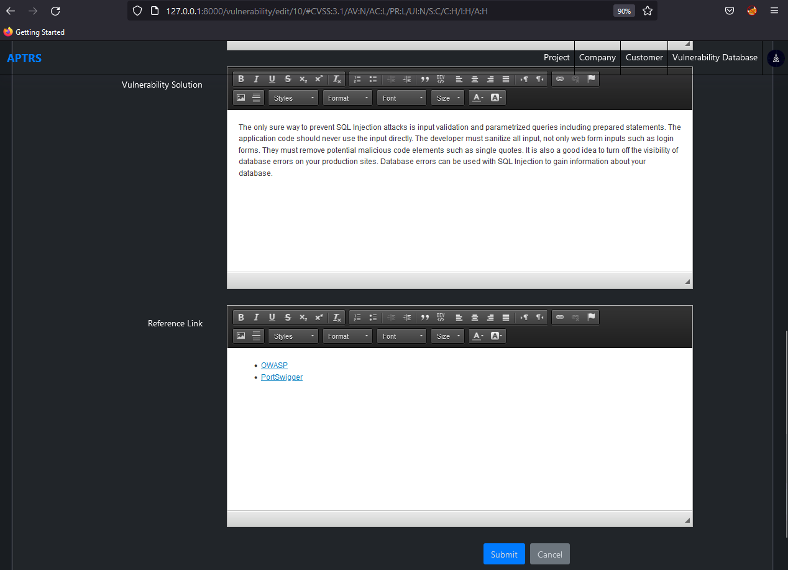

# Vulnerability Database

The vulnerability database allows you to save time while creating a report for a project. If you find some vulnerabilities again and again in different projects while creating reports you don't want to type the same description, or recommendation again and again. In that scenario, you can maintain a vulnerability database where you can add the vulnerability title, description, recommendation, reference link and CVSS Score.

Once you create a new vulnerability for any project you can select the vulnerability from the vulnerability data and it will atomically add the description, recommendation etc for you.

## Vulnerability Database List

If you acess the `http://127.0.0.1:8000/vulnerability/` you are see all the vulnerabilitiesr saved as database collection in the table. You can either delete, edit or add new new from the same page.

## Edit/Add Vulnerability Database 

Once you click on the edit/add button in the above table. You can edit/add the Vulnerability Database details like Vulnerability Title, CVSS Score, Description, Recommendation and Reference Link.

